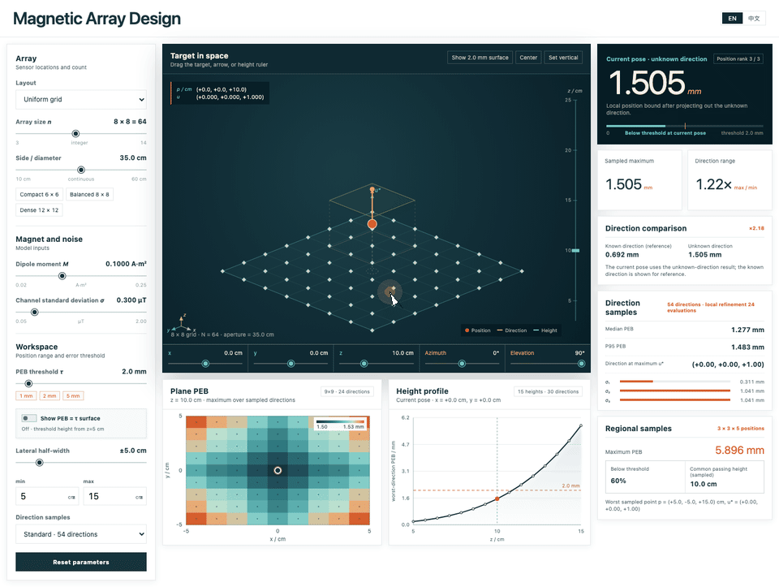
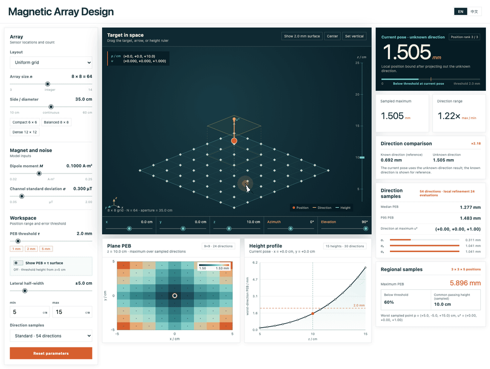
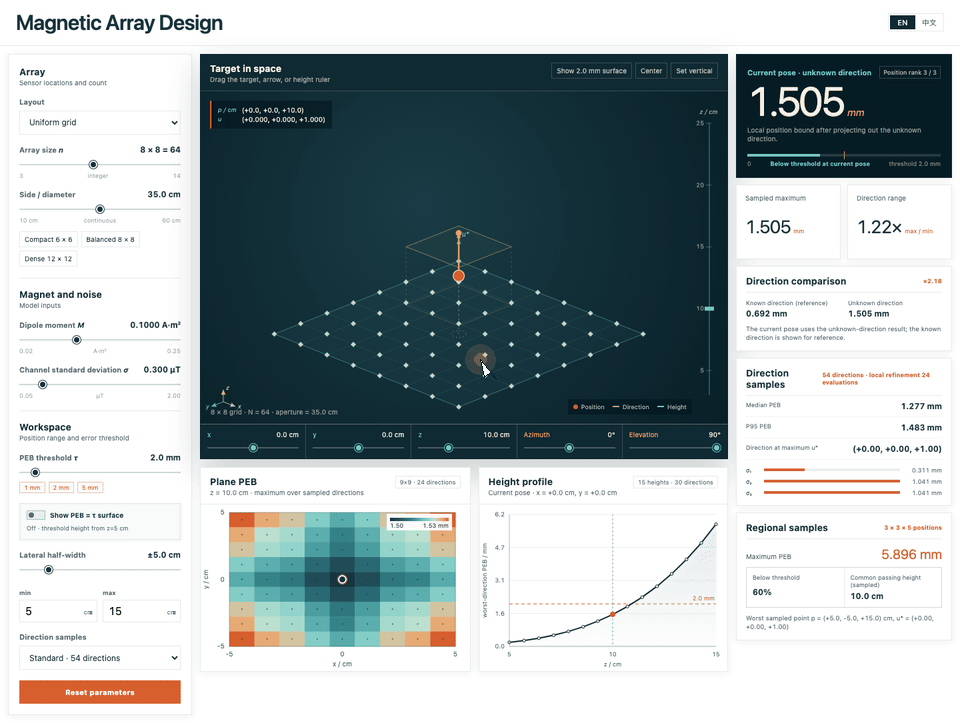

# Magnetic Array Selection Tool

An interactive browser tool for exploring planar magnetic sensor-array designs.

## Demo

  

<em>Change the array size and aperture</em>

  

<em>Move the target and change its direction</em>

  

<em>Show the threshold surface</em>

## What it provides

- Array layout, size, and aperture controls
- Dipole-moment and channel-noise controls
- Workspace limits and an accuracy threshold
- Interactive target position and direction controls
- Current position metric, lateral map, and height profile
- An optional threshold surface for the selected workspace

## Intended use

Use the controls to compare candidate array geometries under the same target,
noise, and workspace settings. 
